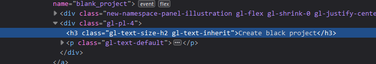

## Summary (Summarize the bug encountered concisely)

    There is a spelling error when creating a new project. 

## Steps to reproduce     

   - Navigate To Projects Page
   - Click Create Project

## What is the current bug behavior?

    The title for creating a new blank project reads "Create black project" 

## What is the expected correct behavior?

    The title should read "Create blank project"
     
## Relevant logs and/or screenshots

    

## Possible fixes

    

## Whom do you report/ Assign To/ Tags

    /Label ~bug ~reproduced ~spelling_error

## Priority

    Major.  The Spelling mistake completeley changes the meaning of the title from what is intended. A severe spelling mistake in such an obvious place hurts our credibility with customers.
